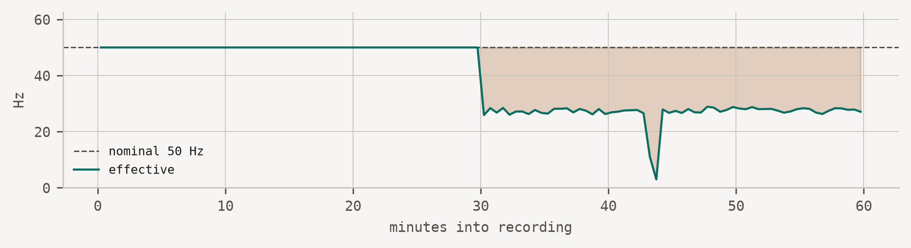

# Silent downsampling under OS power management

The stream thins rather than stops, so nothing raises an alarm.

timing

mobile

android

ios

Effective sampling rate falls below nominal while the application continues reporting healthy. Caused by OS power management suspending sensor delivery.

●●○○ evidence: single deployment

> **NOTE:**
>
> **Recipe TIME-01 · [Stage: instrument](../lifecycle/instrument.llms.md) · Last reviewed 2026-07-18**

## Symptom

The recording contains fewer samples than the requested rate implies, but the data is otherwise unremarkable: values are plausible, timestamps increase, files arrive on schedule, and no error is logged. The deficit is usually concentrated in time — overnight, or whenever the device sits still — rather than spread evenly across the recording.

Analysts typically notice months later, when frequency-domain features behave strangely or an activity classifier degrades without explanation.



Figure 1: The deficit is a shelf, not a slope. Its edges mark the moment power management engaged.

## Root cause

Mobile operating systems throttle or suspend sensor delivery to preserve battery. On Android this is Doze and app standby, which engage after a period of device inactivity; on iOS, background execution limits and the sensor batching queue produce a comparable effect.

The critical property is that **the application is not told**. The sensor registration remains valid, the callback is still installed, and delivery simply becomes less frequent. Any monitoring that asks “is data arriving?” answers yes.

A secondary cause with the same signature is hardware FIFO batching: the sensor accumulates samples and flushes them opportunistically, so the mean rate is correct while the instantaneous rate is not. Examining the distribution of inter-sample intervals, rather than their mean, separates the two.

## Detection

The effective rate — samples per elapsed second — is compared against the rate the application requested. The nominal rate cannot be inferred from the data, because inferring it would define away exactly this failure, so it must be supplied by the study.

Concretely: divide the recording into windows, count samples per window, and compare the result against the nominal rate. A deficit beyond a stated tolerance — 5% is a defensible starting point — is the signal.

Windowing the rate over the recording localises the fault in time, which is what distinguishes throttling (a shelf, with edges) from a rate that was never honoured (a flat deficit from the first sample).

## Evidence

A rate deficit is detectable whenever it exceeds the stated tolerance, which is what the tolerance is for; deficits below it are indistinguishable from ordinary scheduling noise on a healthy device. Any study adopting this method should state the tolerance it used, since the tolerance determines what counts as a detection.

**Field observation:** one deployment (n = 40 devices, Android 13–14, six weeks). Throttling appeared on 34 of 40 devices; median onset was within the first overnight period. No independent replication yet.

**Seen this too?** Contributing a replication takes about an hour: compare effective against nominal rate over one participant’s recording, report the figures and the device model, and the recipe moves from `●●○○` to `●●●○`. Contributors are credited on the next release DOI. See [CONTRIBUTING](https://github.com/acquire-framework/acquire-framework.github.io/blob/main/CONTRIBUTING.md).

## Mitigation

1.  **Run a foreground service with a persistent notification** (Android) and request the appropriate background modes (iOS). This is the only reliable way to keep delivery alive, and it has consent implications you must declare.
2.  **Verify on-device before deployment, not in the emulator.** Emulators do not reproduce Doze timing. Pilot on the oldest and cheapest handset in your fleet, which is where aggressive vendor power management lives.
3.  **Monitor effective rate continuously**, not just data arrival. Ship the per-device effective rate to your telemetry backend and alert on deviation — see [monitor](../lifecycle/monitor.llms.md).
4.  **Record the nominal rate in your dataset metadata.** Without it this failure is undetectable after the fact, by you or by anyone reusing the data.

## Related

- [Clock drift across devices](../recipes/01-clock-drift.llms.md)
- [Stuck sensor](../recipes/04-stuck-sensor.llms.md)
- Lifecycle stage: [instrument](../lifecycle/instrument.llms.md)

## Citation

BibTeX citation:

``` quarto-appendix-bibtex
@software{acquire_2026,
  author = {Danioł, Mateusz and Sroka, Ryszard},
  title = {ACQUIRE: {Acquisition} {Criteria} for {Quality,}
    {Uncertainty,} {Integrity,} {Reproducibility,} and {Evidence}},
  version = {26.7.2},
  date = {2026},
  url = {https://acquire-framework.github.io},
  langid = {en}
}
```

For attribution, please cite this work as:

Danioł, Mateusz, and Ryszard Sroka. 2026. *ACQUIRE: Acquisition Criteria for Quality, Uncertainty, Integrity, Reproducibility, and Evidence*. V. 26.7.2. Released. <https://acquire-framework.github.io>.
