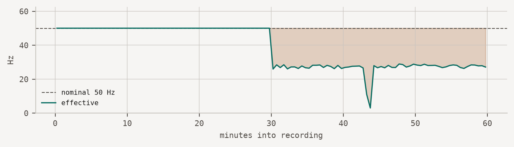

**ACQUIRE 26.7.2** — a fixed snapshot of the specification, built 2026-07-19 from commit `32d64e8`. Thresholds and recipes change as evidence accumulates. [See the current version](https://acquire-framework.github.io/).

# ACQUIRE Framework

Acquisition Criteria for Quality, Uncertainty, Integrity, Reproducibility, and Evidence

Reproducibility begins at acquisition.

Most in-the-wild sensing studies collect invalid data for weeks before anyone notices. Dashboards stay green, files keep arriving, and the failure only surfaces during analysis — when the fieldwork is already spent.

ACQUIRE names those failures, says what each one threatens, and specifies what a study should disclose so a reader can tell whether they occurred.

[Building a study? Start here](lifecycle/index.llms.md) [Something wrong with your data?](recipes/index.llms.md)

## What silent failure looks like

Below is one hour of accelerometer data from a phone that reported itself healthy for the entire recording. The app requested 50 Hz. Every file arrived. No error was logged.



Figure 1: Effective sampling rate collapses halfway through the recording. Nothing in the application’s own telemetry registers this.

Both failures are invisible to conventional monitoring: completeness looks acceptable, no value is impossible, and no error was raised. They are visible only if someone asks what the effective rate was and compares it against what the application requested.

## What ACQUIRE v26.7 contains

**[The acquisition-failure taxonomy](taxonomy/index.llms.md)** — eight failure modes by system layer, each mapped to its signature in the dataset and to the property it threatens. Table 1 of the paper, machine-readable.

**[The Minimum Reporting Checklist](checklist/index.llms.md)** — ten methods-section disclosures about the measuring system. Table 3 of the paper. Complementary to CONSORT-EHEALTH and mERA, which report the intervention rather than the instrument.

**[The failure catalogue](recipes/index.llms.md)** — entered by symptom, for when data already looks wrong. Each entry states what you observe, what causes it, how to detect it, and how well that detection is evidenced.

**[The guideline book](lifecycle/index.llms.md)** — an operational companion for teams building a study, stage by stage.

**Templates and forms** — [sensor schema](templates/index.llms.md#sensor-schema), [quality flags](templates/index.llms.md#quality-flags), [uncertainty statement](templates/index.llms.md#uncertainty-statement), [dataset provenance](templates/index.llms.md#dataset-provenance), and a [reviewer form](templates/index.llms.md#reviewer-form).

**[A worked synchronization example](https://github.com/acquire-framework/acquire-framework.github.io/tree/main/examples/synchronization)** — executable. Two BLE devices at +40 and −25 ppm, re-anchored at reconnection: completeness stays at 100% and every quality flag stays green while the inter-device offset spends 96% of the recording outside a ±20 ms tolerance, peaking near 0.8 s. A record-integrity audit passes this dataset; a measurement-validity audit does not.

## The paper

ACQUIRE — *Acquisition Criteria for Quality, Uncertainty, Integrity, Reproducibility, and Evidence* — treats the whole acquisition chain as a measuring system and evaluates it along three axes: **measurement validity**, **record integrity and provenance**, and **observation-process validity**.

> Danioł, M. and Sroka, R. (2026). Reproducibility Begins at Acquisition: The ACQUIRE Framework for Trustworthy In-the-Wild Sensing. *Companion of the 2026 ACM International Joint Conference on Pervasive and Ubiquitous Computing (UbiComp/ISWC ’26 Companion)*, Shanghai, China.

[How to cite →](cite.llms.md)

## Status

Version 26.7. The catalogue is small and honest about it: every recipe carries an evidence level, and most are currently at the lowest one. The taxonomy is expert-derived and formative rather than systematically validated, and is brought to REPRODUCE for community evaluation and extension.

Replications are the single most useful contribution — see [contributing](https://github.com/acquire-framework/acquire-framework.github.io/blob/main/CONTRIBUTING.md).

## Citation

BibTeX citation:

``` quarto-appendix-bibtex
@inproceedings{daniol2026acquire,
  author = {Danioł, Mateusz and Sroka, Ryszard},
  publisher = {Association for Computing Machinery},
  title = {Reproducibility {Begins} at {Acquisition:} {The} {ACQUIRE}
    {Framework} for {Trustworthy} {In-the-Wild} {Sensing}},
  booktitle = {Companion of the 2026 ACM International Joint Conference
    on Pervasive and Ubiquitous Computing (UbiComp/ISWC ’26 Companion)},
  date = {2026},
  address = {Shanghai, China},
  url = {https://acquire-framework.github.io},
  langid = {en}
}
```

For attribution, please cite this work as:

Danioł, Mateusz, and Ryszard Sroka. 2026. “Reproducibility Begins at Acquisition: The ACQUIRE Framework for Trustworthy In-the-Wild Sensing.” *Companion of the 2026 ACM International Joint Conference on Pervasive and Ubiquitous Computing (UbiComp/ISWC ’26 Companion)* (Shanghai, China). <https://acquire-framework.github.io>.
