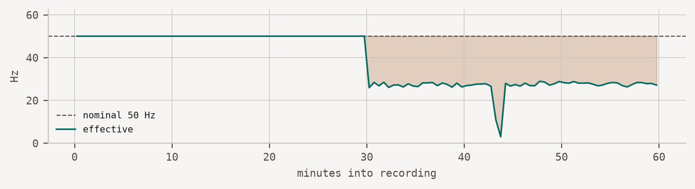

**Version 26.7** — a fixed snapshot, built 2026-07-18 from commit `a11dbb0`. Thresholds and recipes change as evidence accumulates. [See the current version](https://acquire-framework.github.io/).

# Silent downsampling under OS power management

The stream thins rather than stops, so nothing raises an alarm.

timing

mobile

android

ios

Effective sampling rate falls below nominal while the application continues reporting healthy. Caused by OS power management suspending sensor delivery.

●●○○ evidence: single deployment

> **NOTE:**
>
> **Recipe TIME-01 · [Stage: instrument](../lifecycle/instrument.llms.md) · Last reviewed 2026-07-18**

## Symptom

The recording contains fewer samples than the requested rate implies, but the data is otherwise unremarkable: values are plausible, timestamps increase, files arrive on schedule, and no error is logged. The deficit is usually concentrated in time — overnight, or whenever the device sits still — rather than spread evenly across the recording.

Analysts typically notice months later, when frequency-domain features behave strangely or an activity classifier degrades without explanation.

|  |  |  |  |  |
|----|----|----|----|----|
| ✓ | Timestamp monotonicity | 0 non-increasing steps | 0 |  |
| × | Effective vs nominal sampling rate | 38.41 Hz (77% of nominal) | 50.00 Hz ±5% | [recipe →](../recipes/03-doze-downsampling.llms.md) |
| × | Stream continuity | 1 gaps, 45.1 s lost, longest 45.1 s | no interval \> 1.0 s | [recipe →](../recipes/03-doze-downsampling.llms.md) |
| × | Sampling regularity | jitter 100.0% above median interval (p90) | ≤ 25% | [recipe →](../recipes/03-doze-downsampling.llms.md) |
| ✓ | Resting magnitude | 9.806 m/s² (1.000 g) | 9.807 m/s² ±2% |  |
| ✓ | Stuck sensor | longest frozen run 0.0 s | ≤ 2.0 s |  |
| ✓ | Saturation | 0.001% of samples at rail (±15.6 m/s²) | ≤ 0.1% |  |



Figure 1: The deficit is a shelf, not a slope. Its edges mark the moment power management engaged.

## Root cause

Mobile operating systems throttle or suspend sensor delivery to preserve battery. On Android this is Doze and app standby, which engage after a period of device inactivity; on iOS, background execution limits and the sensor batching queue produce a comparable effect.

The critical property is that **the application is not told**. The sensor registration remains valid, the callback is still installed, and delivery simply becomes less frequent. Any monitoring that asks “is data arriving?” answers yes.

A secondary cause with the same signature is hardware FIFO batching: the sensor accumulates samples and flushes them opportunistically, so the mean rate is correct while the instantaneous rate is not. The [regularity check](#detection) separates the two.

## Detection

The effective rate — samples per elapsed second — is compared against the rate the application requested. The nominal rate cannot be inferred from the data, because inferring it would define away exactly this failure, so it must be supplied:

``` python
import acquire

report = acquire.check(df, nominal_hz=50)   # nominal must be stated, not inferred
[r for r in report.results if not r.passed]
```

    [CheckResult(id='TIME-01', title='Effective vs nominal sampling rate', passed=np.False_, value='38.41 Hz (77% of nominal)', expected='50.00 Hz ±5%', detail='138273 samples over 3600.0 s. A deficit concentrated in time indicates throttling; a uniform deficit indicates the requested rate was never honoured.', recipe='recipes/03-doze-downsampling.html'),
     CheckResult(id='TIME-02', title='Stream continuity', passed=False, value='1 gaps, 45.1 s lost, longest 45.1 s', expected='no interval > 1.0 s', detail='Gaps clustering overnight or during device idle periods point to OS power management rather than hardware or connectivity.', recipe='recipes/03-doze-downsampling.html'),
     CheckResult(id='TIME-04', title='Sampling regularity', passed=False, value='jitter 100.0% above median interval (p90)', expected='≤ 25%', detail='Median interval 20.0 ms. High jitter with a correct mean rate indicates hardware FIFO batching rather than sample loss.', recipe='recipes/03-doze-downsampling.html')]

Windowing the rate over the recording localises the fault in time, which is what distinguishes throttling (a shelf, with edges) from a rate that was never honoured (a flat deficit from the first sample).

## Evidence

The detector’s sensitivity is measured against synthetic recordings with faults of known magnitude, rather than asserted. This table is generated at build time:

|     | samples retained | effective rate | detected |
|-----|------------------|----------------|----------|
| 0   | 95%              | 47.50 Hz       | yes      |
| 1   | 90%              | 45.00 Hz       | yes      |
| 2   | 85%              | 42.50 Hz       | yes      |
| 3   | 80%              | 40.00 Hz       | yes      |
| 4   | 70%              | 35.00 Hz       | yes      |
| 5   | 50%              | 25.00 Hz       | yes      |

Detection is reliable once the deficit exceeds the 5% rate tolerance, which is the tolerance’s purpose; deficits below that are indistinguishable from ordinary scheduling noise on a healthy device.

**Field observation:** one deployment (n = 40 devices, Android 13–14, six weeks). Throttling appeared on 34 of 40 devices; median onset was within the first overnight period. No independent replication yet.

**Seen this too?** Contributing a replication takes about an hour: run `acquire check` over one participant’s recording, report the effective rate and device model, and the recipe moves from `●●○○` to `●●●○`. Contributors are credited on the next release DOI. See [CONTRIBUTING](https://github.com/acquire-framework/acquire-framework.github.io/blob/main/CONTRIBUTING.md).

## Mitigation

1.  **Run a foreground service with a persistent notification** (Android) and request the appropriate background modes (iOS). This is the only reliable way to keep delivery alive, and it has consent implications you must declare.
2.  **Verify on-device before deployment, not in the emulator.** Emulators do not reproduce Doze timing. Pilot on the oldest and cheapest handset in your fleet, which is where aggressive vendor power management lives.
3.  **Monitor effective rate continuously**, not just data arrival. Ship the per-device effective rate to your telemetry backend and alert on deviation — see [monitor](../lifecycle/monitor.llms.md).
4.  **Record the nominal rate in your dataset metadata.** Without it this failure is undetectable after the fact, by you or by anyone reusing the data.

## Related

- [Clock drift across devices](../recipes/01-clock-drift.llms.md)
- [Stuck sensor](../recipes/04-stuck-sensor.llms.md)
- Lifecycle stage: [instrument](../lifecycle/instrument.llms.md)

## Citation

BibTeX citation:

``` quarto-appendix-bibtex
@inproceedings{daniol2026acquire,
  author = {Danioł, Mateusz and Sroka, Ryszard},
  publisher = {Association for Computing Machinery},
  title = {Reproducibility {Begins} at {Acquisition:} {The} {ACQUIRE}
    {Framework} for {Trustworthy} {In-the-Wild} {Sensing}},
  booktitle = {Companion of the 2026 ACM International Joint Conference
    on Pervasive and Ubiquitous Computing (UbiComp/ISWC ’26 Companion)},
  date = {2026},
  address = {Shanghai, China},
  url = {https://acquire-framework.github.io},
  langid = {en}
}
```

For attribution, please cite this work as:

Danioł, Mateusz, and Ryszard Sroka. 2026. “Reproducibility Begins at Acquisition: The ACQUIRE Framework for Trustworthy In-the-Wild Sensing.” *Companion of the 2026 ACM International Joint Conference on Pervasive and Ubiquitous Computing (UbiComp/ISWC ’26 Companion)* (Shanghai, China). <https://acquire-framework.github.io>.
